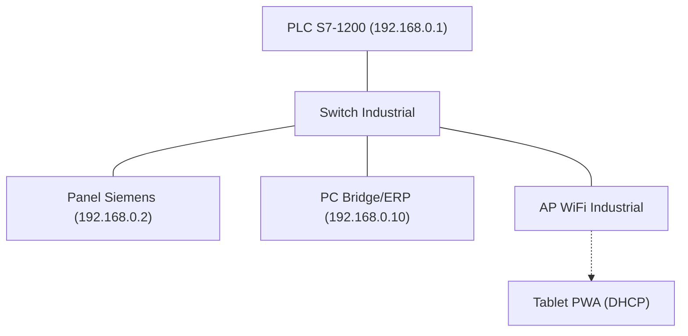

# Hoja de Ruta: Implementación Física (Go-Live)
## Sistema ZASCA — Paternoster para FASECOL
**Versión 1.0 | Febrero 2026**

---

## 1. Lista de Materiales (BOM - Bill of Materials)

Para llevar este proyecto a la realidad, se recomienda el siguiente hardware industrial:

| Componente | Especificación Recomendada | Cantidad | Función Principal |
|------------|----------------------------|----------|-------------------|
| **Controlador (PLC)** | Siemens S7-1200 CPU 1214C DC/DC/DC | 1 | Procesamiento de lógica y PID |
| **Variador (VFD)** | Siemens SINAMICS G120 (0.75kW - 7.5kW) | 1 | Control de velocidad del motor |
| **Motor** | Motor Trifásico 10HP (IE3) + Freno Electromagnético | 1 | Accionamiento mecánico |
| **Encoder** | Incremental 1024 PPR (HTL/TTL) | 1 | Retroalimentación de posición |
| **Sensores Reflex** | Sick/Ifm (Salida PNP) | 1 | Detección de retiro de arnés |
| **Sensores Induc.** | Sensores de proximidad para Home/FC | 2 | Calibración y seguridad |
| **Seguridad** | Cortinas Infrarrojas (SIL 3) | 1 | Protección área de picking |
| **Switch** | Scalance o Switch Industrial Unmanaged | 1 | LAN PROFINET / Ethernet |

---

## 2. Arquitectura de Red y Direccionamiento

La comunicación se basa en una red local industrial aislada.

### Mapa de IPs Sugerido:
*   **PLC:** `192.168.0.1` (Base de control para todas las opciones)
*   **Opción B — HMI (WinCC):** `192.168.0.2`
*   **Opción A — PC Bridge (Backend):** `192.168.0.10`
*   **Opción C — Tablet PWA:** Conectada vía WiFi al PC Bridge (DHCP)

---

## 3. Mapeo de Entradas/Salidas Físicas (I/O)

Basado en la lógica de `Processor.ts` y la `GUIA_INTEGRACION_AUTOMATIZADOR.md`.

### Entradas Digitales (24VDC)
- `%I0.0`: Seta de Emergencia (NC)
- `%I0.1`: Pulsador START (NO)
- `%I0.2`: Pulsador STOP (NC)
- `%I0.4`: Sensor Puerta Cerrada (NC)
- `%I0.5`: Cortina de Seguridad (NC)
- `%I0.6`: Sensor Reflex Picking (NO)

### Salidas Digitales (24VDC)
- `%Q0.0`: Contactor Motor / Enable VFD
- `%Q0.1`: Liberación de Freno (Relé)
- `%Q0.2`: Lámpara "En Marcha"
- `%Q0.3`: Lámpara "Listo para Picking"
- `%Q1.0`: Semáforo Rojo (Falla/Emergencia)

---

## 4. Guía de Migración de Software

### 4.1. Del Gemelo Digital al PLC (S7-SCL)
La lógica del archivo `src/simulation/PLC/Processor.ts` debe portarse a un Bloque de Función (FB) en TIA Portal. 
- La máquina de estados es compatible con `CASE ... OF`.
- El control de velocidad por pasos (Steps) se implementa enviando el valor al `Setpoint` del VFD vía PROFINET o Analógica (`%QW64`).

### 4.2. Opción B: Instalación de WinCC Nativo
1. Importar `Tags_Import.csv` en el proyecto de TIA Portal.
2. Crear las pantallas siguiendo los nombres de objetos definidos en `wincc-scripts/`.
3. Copiar la lógica de los archivos `.js` de la carpeta `wincc-scripts/` en los eventos de los botones y pantallas.

### 4.3. Opción A y C: Configuración del Bridge y Tablet
1. Instalar Node.js en el PC de Gestión (`192.168.0.10`).
2. Configurar el archivo `.env` en `plc-bridge/` con la IP del PLC (`192.168.0.1`).
3. Activar los permisos **PUT/GET** en las propiedades del PLC en TIA Portal para permitir la comunicación remota.
4. Para la **Opción C**, configurar el Access Point WiFi para que la Tablet acceda a la URL del PC Bridge.

---

## 5. Pruebas de Aceptación (SAT)

Antes de la puesta en marcha con carga real:
1.  **Test de Sentido:** Verificar que "ARRIBA" en el HMI sube físicamente las bandejas.
2.  **Test de Seguridad:** Presionar la seta de emergencia durante el movimiento; el freno debe actuar instantáneamente.
3.  **Calibración:** Ajustar el `M60_CalibrationOffset` en el HMI para que la bandeja quede alineada matemáticamente con el sensor reflex.
4.  **Sincronización:** Retirar un arnés real y verificar que el stock en el PC Bridge (Logger) disminuye automáticamente.

---
> [!TIP]
> **Recomendación Final:** Utilice cable apantallado para el encoder y el motor para evitar interferencias electromagnéticas (EMI) que podrían afectar la precisión del inventario.
