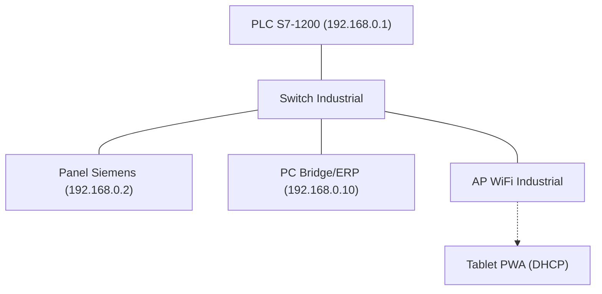

# MANUAL DE INGENIERÍA INTEGRAL: CARRUSEL PATERNISTER ZASCA
## Ingeniería de Control, Software y Despliegue Físico v2.0
**Proyecto para FASECOL | Febrero 2026**

---

## 1. Introducción y Alcance

Este manual es la **fuente única de verdad** para la implementación del sistema ZASCA. Consolida la especificación de hardware, la lógica de control del PLC, la integración de software y las guías de despliegue en campo.

El sistema implementa tres capas paralelas que cumplen la misma lógica funcional:

| Opción | Tecnología | Uso Principal |
|--------|-----------|---------------|
| **A** — Bridge Web | Node.js + React | Supervisión desde PC o navegador |
| **B** — WinCC Nativo | JavaScript (WinCC Unified) | Panel HMI Siemens en campo |
| **C** — Tablet PWA | React (Progressive Web App) | Tablet industrial portátil |

---

## 2. Fase 1: Especificaciones de Hardware y Red (Go-Live)

### 2.1. Lista de Materiales (BOM)
Para llevar el proyecto a la realidad física, se requiere el siguiente hardware industrial:

| Componente | Especificación Recomendada | Cantidad | Función Principal |
|------------|----------------------------|----------|-------------------|
| **Controlador (PLC)** | Siemens S7-1200 CPU 1214C DC/DC/DC | 1 | Procesamiento de lógica y PID |
| **Variador (VFD)** | Siemens SINAMICS G120 (0.75kW - 7.5kW) | 1 | Control de velocidad del motor |
| **Motor** | Motor Trifásico 10HP (IE3) + Freno Electromagnético | 1 | Accionamiento mecánico |
| **Encoder** | Incremental 1024 PPR (HTL/TTL) | 1 | Retroalimentación de posición |
| **Sensores Reflex** | Sick/Ifm (Salida PNP) | 1 | Detección de retiro de arnés |
| **Sensores Induc.** | Sensores de proximidad para Home/FC | 2 | Calibración y seguridad |
| **Seguridad** | Cortinas Infrarrojas (SIL 3) | 1 | Protección área de picking |
| **Switch** | Scalance o Switch Industrial Unmanaged | 1 | LAN PROFINET / Ethernet |

### 2.2. Arquitectura de Red y Direccionamiento
La comunicación se basa en una red local industrial aislada.



**Mapa de IPs Sugerido:**
*   **PLC:** `192.168.0.1` (Base de control)
*   **HMI (WinCC - Opción B):** `192.168.0.2`
*   **PC Bridge (Opción A/C):** `192.168.0.10`
*   **Subred Máquina:** `192.168.0.0/24`

### 2.3. Mapeo de Entradas/Salidas Físicas (Digital I/O)
| Dirección | Tipo | Dispositivo | Descripción |
|-----------|------|-------------|-------------|
| `%I0.0` | DI | Seta de Emergencia | Parada de seguridad (NC) |
| `%I0.1` | DI | Botón START | Arranque manual (NO) |
| `%I0.2` | DI | Botón STOP | Parada manual (NC) |
| `%I0.4` | DI | Sensor Puerta | Protección de acceso (NC) |
| `%I0.5` | DI | Cortina Seguridad| Barrera infrarroja (NC) |
| `%I0.6` | DI | Sensor Reflex | Detección de picking (NO) |
| `%Q0.0` | DO | Contactor Motor | Enable de potencia |
| `%Q0.1` | DO | Freno | Liberación de freno mecánico |
| `%Q0.2` | DO | Lámpara Run | Indicador en marcha |
| `%Q1.0` | DO | Torre Roja | Alarma/Falla |

---

## 3. Fase 2: Configuración del Cerebro (PLC & Tags)

El PLC Siemens S7-1200 utiliza tres bloques de datos (DB) organizados por función.

### 3.1. DB1 — Comandos (HMI → PLC)
| Tag | Tipo | Dirección PLC | Descripción |
|-----|------|--------------|-------------|
| `CMD_TargetTray` | INT | DB1.DBW0 | Bandeja objetivo (0-19) |
| `CMD_Start` | BOOL | DB1.DBX4.0 | Arranque (pulso) |
| `CMD_Stop` | BOOL | DB1.DBX4.1 | Parada normal |
| `CMD_EStop` | BOOL | DB1.DBX4.2 | Emergencia software |
| `CMD_AutoMode` | BOOL | DB1.DBX4.4 | Habilitar modo automático |
| `CMD_SearchRef` | STRING | DB1.DBB6 | Referencia a buscar |

### 3.2. DB2 — Estado y Telemetría (PLC → HMI)
| Tag | Tipo | Dirección PLC | Descripción |
|-----|------|--------------|-------------|
| `ST_EncoderPos` | REAL | DB2.DBD0 | Posición real (grados) |
| `ST_VFD_Speed` | REAL | DB2.DBD4 | Velocidad actual (%) |
| `ST_MotorRunning`| BOOL | DB2.DBX8.0 | Motor encendido |
| `ST_PosReached` | BOOL | DB2.DBX8.5 | Llegada confirmada |
| `TEL_Torque` | REAL | DB2.DBD20 | Torque motor (Nm) |
| `TEL_Current` | REAL | DB2.DBD24 | Consumo motor (A) |

### 3.3. DB3 — Inventario DETALLADO (20 bandejas × 30 bytes)
Cada bandeja ocupa 30 bytes con la siguiente estructura repetitiva:

| Offset | Tipo | Tag | Descripción |
|--------|------|-----|-------------|
| +0 | STRING[20] | `INV_Ref_N` | Referencia principal |
| +22 | INT | `INV_Qty_N` | Cantidad total |
| +24 | INT | `INV_T[N]_RefA` | Unidades Tipo A |
| +26 | INT | `INV_T[N]_RefB` | Unidades Tipo B |
| +28 | INT | `INV_T[N]_RefC` | Unidades Tipo C |
| +30 | INT | `INV_T[N]_RefD` | Unidades Tipo D |
| +32 | INT | `INV_T[N]_RefE` | Unidades Tipo E |
| +34 | INT | `INV_T[N]_RefF` | Unidades Tipo F |

> [!IMPORTANT]
> Esta estructura v2.0 permite la iluminación dinámica de colores en la vista de animación WinCC y React.

---

## 4. Fase 3: Lógica de Operación — Ciclo de Picking

La lógica de picking es idéntica en las tres tecnologías (React, WinCC, PLC).

```
1. IDLE: Espera selección de bandeja.
2. MOVING (Mover): CMD_TargetTray = N, CMD_Start = pulso.
3. ARRIVED (Llegada): ST_PosReached = true.
4. EXTRACTED (Sacar): I0_6_ReflexSensor activa botón RETIRAR.
5. REMOVED (Retirar): Descuenta stock, CMD_AutoMode = false (RESET CRÍTICO).
```

---

## 5. Fase 4: Despliegue de Interfaces

### 5.1. OPCIÓN A: Bridge Web (PC de Gestión)
- **Servidor:** `plc-bridge/server.js` (Node.js).
- **Configuración:** Editar `.env` con `PLC_IP=192.168.0.1`.
- **Inventario:** Incluye API para reportes Excel en `plc-bridge/reportGenerator.js`.

### 5.2. OPCIÓN B: WinCC Nativo (HMI Industrial)
- **Importación:** Usar `wincc-scripts/Tags_Import.csv` (187 tags).
- **Scripts:** Pegar archivos `.js` de `wincc-scripts/` en los eventos de TIA Portal.
- **Animación:** El script `06_Scr_Animacion/Animate_Carousel.js` maneja la vista 2D.

### 5.3. OPCIÓN C: Tablet PWA (Movilidad)
- **Acceso:** Navegar a `http://192.168.0.10:3000` desde la Tablet.
- **Instalación:** Botón "Instalar" en Chrome/Edge para modo "App Nativa".

---

## 6. Fase 5: Puesta en Marcha (SAT)

1. **Permisología:** En TIA Portal, activar **"Permitir comunicación PUT/GET"**.
2. **Calibración:** Ajustar `M60_CalibrationOffset` para alinear bandeja con sensor físico.
3. **Prueba Loop:** Verificar que al finalizar un ciclo, el motor NO arranque solo (Fix de AutoMode).

---
*Documento Unificado - Sistema de Ingeniería ZASCA*
