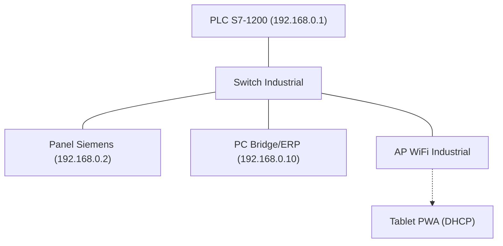

# MANUAL TÉCNICO INTEGRAL: CARRUSEL PATERNISTER ZASCA
## Ingeniería de Control, Software y Despliegue Físico
**Proyecto para FASECOL | Versión 3.0 | Febrero 2026**

---

## INTRODUCCIÓN
Este manual consolida toda la documentación técnica necesaria para la construcción, programación y puesta en marcha del sistema de carrusel automatizado ZASCA. Combina la especificación de hardware industrial con la lógica avanzada de gestión de inventario v2.0.

---

## FASE 1: ARQUITECTURA Y ESPECIFICACIONES FÍSICAS

### 1.1. Lista de Materiales (BOM - Bill of Materials)
Para la construcción real del sistema, se requiere el siguiente hardware estándar:

| Componente | Especificación Recomendada | Cantidad | Función |
|------------|----------------------------|----------|---------|
| **PLC** | Siemens S7-1200 CPU 1214C DC/DC/DC | 1 | Controlador Maestro |
| **Variador (VFD)** | Siemens SINAMICS G120 | 1 | Control de Velocidad |
| **Motor** | 10HP Trifásico + Freno | 1 | Tracción Mecánica |
| **Encoder** | Incremental 1024 PPR | 1 | Feedback de Posición |
| **Sensores** | Reflex (Picking) e Inductivos (Home) | 3 | Detección y Calibración |
| **Seguridad** | Cortinas (SIL 3) + Paro Emergencia | 1 | Protección Operario |

### 1.2. Topología de Red Industrial
El sistema utiliza una red aislada para garantizar latencia mínima y seguridad.

### 1.3. Mapeo de E/S Físicas (Digital I/O)
| Dirección | Tipo | Dispositivo | Lógica |
|-----------|------|-------------|--------|
| `%I0.0` | DI | Seta Emergencia | NC (Cerrado) |
| `%I0.5` | DI | Cortina Seguridad| NC (Cerrado) |
| `%I0.6` | DI | Sensor Picking | NO (Abierto) |
| `%Q0.0` | DO | Freno / Enable | Salida a Relé |
| `%Q0.2` | DO | Luz Proceso | Indicador HMI |

---

## FASE 2: CONFIGURACIÓN DEL CEREBRO (PLC & TAGS)

### 2.1. Mapa de Memoria (DBs)
El PLC se organiza en 3 bloques de datos principales:

- **DB1 (CMD):** Comandos HMI → PLC (Ej: `CMD_Start`, `CMD_TargetTray`).
- **DB2 (ST):** Estado PLC → HMI (Ej: `ST_MotorRunning`, `TEL_Position`).
- **DB3 (INV):** Inventario detallado (20 bandejas × 30 bytes).

### 2.2. Inventario Detallado v2.0 (Arneses A-F)
Cada bandeja ocupa 30 bytes con soporte para 6 referencias individuales:

| Offset | Tag WinCC | Descripción |
|--------|-----------|-------------|
| +0 | `INV_Ref_N` | Nombre de la referencia base |
| +22 | `INV_Qty_N` | Total unidades en la bandeja |
| +24 | `INV_T[N]_RefA` | Unidades Arnés Tipo A |
| ... | ... | ... |
| +34 | `INV_T[N]_RefF` | Unidades Arnés Tipo F |

### 2.3. Migración de Lógica
La lógica simulada en `Processor.ts` debe portarse al PLC usando **S7-SCL**.
- La máquina de estados principal maneja los modos: `IDLE`, `MOVING`, `ARRIVED`, `ERROR`.
- El control de posición usa un bloque PID estándar de Siemens afinado con los parámetros de calibración.

---

## FASE 3: DESPLIEGUE DE INTERFACES (OPCIONES A, B, C)

El sistema soporta redundancia funcional mediante tres modos de operación:

### 3.1. Opción A: Integración IT (Bridge + ERP)
- **Servidor:** `plc-bridge/server.js` (Node.js).
- **Funcionalidad:** API REST para carga masiva, WebSockets para monitoreo real y **Reportes de Turno en Excel**.
- **Acceso:** `http://192.168.0.10:3001`.

### 3.2. Opción B: HMI Industrial (WinCC Nativo)
- **Hardware:** Panel Siemens KTP700 o similar.
- **Sincronización:** Importar `wincc-scripts/Tags_Import.csv` (187 tags).
- **Animación:** Script `Animate_Carousel.js` para visualización 2D de bandejas.

### 3.3. Opción C: Movilidad (Tablet PWA)
- **Instalación:** Acceder a la IP del Bridge desde Chrome en la Tablet.
- **Ventaja:** Permite al operario realizar el picking desplazándose libremente por la zona de carga.

---

## FASE 4: PUESTA EN MARCHA Y SEGURIDAD

### 4.1. Protocolo de Pruebas SAT
1. **Reset Total:** Verificar que el sistema vuelve a `IDLE` después de un fallo de sensor.
2. **Calibración de Posición:** Ajustar el offset para que el sensor reflex coincida con el centro de la zona de picking.
3. **Validación de Inventario:** Confirmar que al retirar un arnés (físico), el tag `INV_T[N]_RefX` descuenta en el PLC y el HMI.

### 4.2. Matriz de Mantenimiento
- **Semanal:** Limpieza de sensores ópticos (Reflex).
- **Mensual:** Verificación de tensión de cadena y lubricación.
- **Trimestral:** Backup de logs de inventario (`inventory_log.json`).

---
> [!IMPORTANT]
> **Seguridad PUT/GET:** En TIA Portal, debe activarse explícitamente el permiso de acceso PUT/GET en las propiedades de protección del PLC para que el Bridge pueda sincronizar el inventario.

*Documento consolidado por: Sistema de Ingeniería ZASCA*
