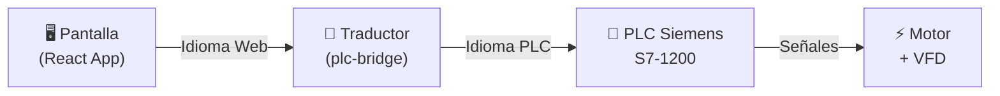
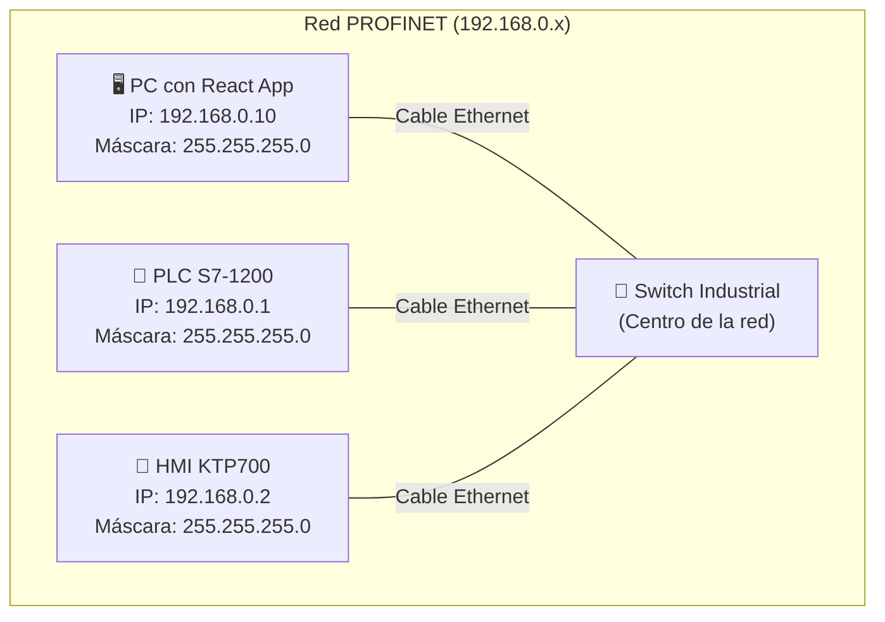
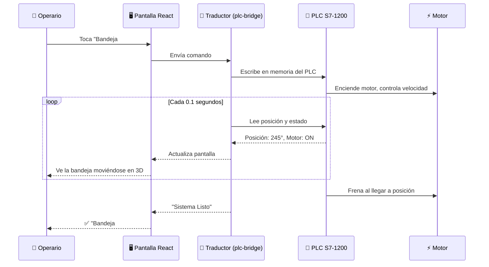
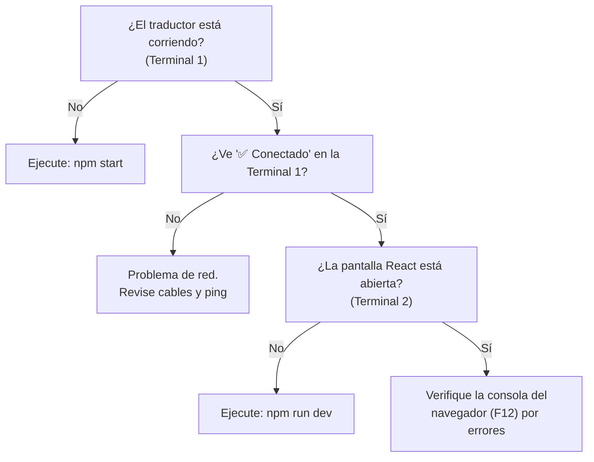

# 🔧 Manual de Conexión: Pantalla React ↔ PLC Siemens S7
**Guía Paso a Paso para Personal Técnico**

**Proyecto:** ZASCA — Almacén Rotativo Vertical (Paternoster)  
**Fecha:** 20 de Febrero de 2026  
**Nivel:** Principiante — No requiere experiencia en programación.

---

## 📖 ¿Qué estamos haciendo?

Vamos a conectar **dos cosas** que hoy trabajan por separado:

| Elemento | ¿Qué es? | ¿Dónde está? |
|:---|:---|:---|
| **La Pantalla** (React App) | El programa que muestra las bandejas, botones y la animación 3D | En un Computador / Tablet |
| **El Cerebro** (PLC Siemens S7-1200) | El controlador que realmente mueve el motor eléctrico | En el Gabinete Eléctrico |

**El problema:** La pantalla no puede hablar directamente con el PLC porque usan "idiomas" diferentes.

**La solución:** Instalamos un **programa traductor** (llamado `plc-bridge`) en el mismo computador que tiene la pantalla. Este programa traduce entre los dos:



---

## 📦 ¿Qué necesita antes de empezar?

### Hardware (Cosas Físicas)

- [ ] Computador con Windows 10/11 (donde corre la pantalla React)
- [ ] PLC Siemens S7-1200 (CPU 1214C o superior) **encendido y programado**
- [ ] Cable de Red Ethernet Cat6 (mínimo 2 cables)
- [ ] Switch Industrial Ethernet (o switch de oficina para pruebas)
- [ ] El programa del PLC ya cargado desde TIA Portal (los bloques SCL)

### Software (Programas)

- [ ] **Node.js** versión 18 o superior (ya incluido si tiene el simulador React funcionando)
- [ ] **Los archivos del `plc-bridge`** (ya están en la carpeta del proyecto)

> **💡 ¿No sabe si tiene Node.js?**  
> Abra una ventana de comandos (PowerShell o CMD) y escriba:
> ```
> node --version
> ```
> Si aparece algo como `v18.17.0` o superior, ya lo tiene. Si dice "no se reconoce", necesita instalarlo desde [nodejs.org](https://nodejs.org).

---

## 🔌 Paso 1: Conexión Física (Los Cables)

### Diagrama de Red



### Instrucciones:

1. **Conecte un cable Ethernet** desde el **PLC** al **Switch**
2. **Conecte otro cable Ethernet** desde el **Computador** al mismo **Switch**
3. Si tiene una pantalla HMI, conéctela también al Switch

### Configurar la IP del Computador

El computador debe tener una IP en el mismo rango que el PLC. Siga estos pasos:

1. Abra **Panel de Control** → **Redes e Internet** → **Centro de redes** → **Cambiar configuración del adaptador**
2. Haga clic derecho en su conexión Ethernet → **Propiedades**
3. Seleccione **Protocolo de Internet versión 4 (TCP/IPv4)** → **Propiedades**
4. Seleccione **"Usar la siguiente dirección IP"** y escriba:

| Campo | Valor |
|:---|:---|
| **Dirección IP** | `192.168.0.10` |
| **Máscara de subred** | `255.255.255.0` |
| **Puerta de enlace** | (dejar vacío) |

5. Haga clic en **Aceptar** y cierre todo

### Verificar la Conexión

Abra PowerShell o CMD y escriba:

```
ping 192.168.0.1
```

**✅ Si ve respuestas** (como "Respuesta desde 192.168.0.1: bytes=32"), ¡la conexión física está bien!

**❌ Si dice "Tiempo de espera agotado"**, revise:
- ¿Los cables están bien conectados? (Las luces verdes del switch deben parpadear)
- ¿El PLC está encendido? (LED RUN debe estar en verde)
- ¿La IP del PLC realmente es 192.168.0.1? (Verifique en TIA Portal)

---

## ⚙️ Paso 2: Configurar el PLC en TIA Portal

> **⚠️ IMPORTANTE:** Este paso requiere que alguien con acceso a TIA Portal lo haga. Si usted no tiene TIA Portal, pida a su ingeniero de automatización que realice este paso.

Para que el programa traductor pueda comunicarse con el PLC, hay que **desbloquear** una protección de seguridad:

1. Abra **TIA Portal**
2. En el árbol del proyecto, haga clic en su **CPU** (ej: CPU 1214C)
3. Vaya a: **Propiedades** → **Protection & Security** → **Connection mechanisms**
4. Marque la casilla: ✅ **"Permit access with PUT/GET communication from remote partner"**
5. **Descargue** el programa al PLC (compilar y cargar)

```
┌─────────────────────────────────────────────────┐
│  TIA Portal → CPU Properties                    │
│                                                 │
│  Protection & Security                          │
│  └── Connection mechanisms                      │
│      └── ☑ Permit access with PUT/GET           │
│           communication from remote partner     │
│                                                 │
│  [Compile and Download to PLC]                  │
└─────────────────────────────────────────────────┘
```

> **¿Por qué es necesario esto?**  
> Por seguridad, Siemens bloquea las conexiones externas al PLC por defecto. Al activar esta opción, le estamos diciendo al PLC: "Está bien que el computador con la pantalla te envíe y lea datos."

---

## 🚀 Paso 3: Instalar el Programa Traductor

### 3.1 Abrir la Carpeta del Proyecto

Abra **PowerShell** (busque "PowerShell" en el menú de Windows) y navegue a la carpeta del traductor:

```powershell
cd "C:\Users\User\OneDrive\Documents\ZASCA\8. MODELO\plc-bridge"
```

### 3.2 Instalar Dependencias

> Solo necesita hacer esto **UNA VEZ** (la primera vez):

```powershell
npm install
```

Espere a que termine. Verá algo como:
```
added 119 packages in 6s
```

¡Eso es todo! Ya quedó instalado.

---

## 🧪 Paso 4: Probar la Conexión (Modo Simulador)

Antes de conectarse al PLC real, probemos que todo funciona con el **simulador** (sin PLC):

```powershell
node test-connection.js
```

Debería ver algo así:

```
╔══════════════════════════════════════╗
║   ZASCA - Test de Conexión PLC       ║
╚══════════════════════════════════════╝

🟢 Modo: MOCK (Simulador local)

── Paso 1: Conectando...
   ✅ Conexión establecida

── Paso 2: Leyendo estado del PLC...
   📊 ST_EncoderPos        = 0
   📊 ST_MotorRunning       = false
   📊 ST_SystemReady        = true

── Paso 3: Leyendo inventario...
   ┌─────┬──────────────────────────┬──────┬────────┐
   │ ID  │ Referencia               │ Cant │ Peso   │
   ├─────┼──────────────────────────┼──────┼────────┤
   │  0  │ VACIO                    │   23 │   35.2 │
   │  1  │ TORNILLOS M4             │   41 │   12.8 │
   │ ... │ ...                      │  ... │   ...  │
   └─────┴──────────────────────────┴──────┴────────┘

── Paso 4: Prueba de escritura...
   ✅ Escritura exitosa

── Paso 5: Verificar lectura...
   CMD_TargetTray = 3

╔══════════════════════════════════════╗
║   ✅ TODAS LAS PRUEBAS PASARON      ║
╚══════════════════════════════════════╝
```

**✅ Si ve este resultado:** Todo funciona. Pase al siguiente paso.

**❌ Si ve un error:** Verifique que Node.js esté instalado y que ejecutó `npm install`.

---

## 🏭 Paso 5: Conectarse al PLC Real

Ahora vamos a cambiar del simulador al PLC real.

### 5.1 Editar el Archivo de Configuración

Abra el archivo `.env` que está en la carpeta `plc-bridge`. Puede abrirlo con el **Bloc de Notas**:

```powershell
notepad .env
```

Cambie la línea `MODE=mock` por `MODE=live`:

```diff
- MODE=mock
+ MODE=live
```

Verifique que la IP del PLC sea correcta:
```
PLC_IP=192.168.0.1
PLC_RACK=0
PLC_SLOT=1
```

> **💡 Sobre RACK y SLOT:**
> - Para **S7-1200**: siempre es RACK=0, SLOT=1
> - Para **S7-1500**: siempre es RACK=0, SLOT=1
> - Para **S7-300**: típicamente RACK=0, SLOT=2

Guarde y cierre el archivo.

### 5.2 Probar Conexión al PLC Real

```powershell
node test-connection.js
```

Ahora debería ver:

```
🔌 Modo: LIVE (PLC Real)
   IP:   192.168.0.1

── Paso 1: Conectando...
   ✅ Conexión establecida    ← ¡Esto es lo importante!
```

**❌ Si dice "Error de conexión"**, revise estas causas comunes:

| Problema | Solución |
|:---|:---|
| "Connection timeout" | 1. ¿El PLC está encendido? 2. ¿Hizo `ping` exitoso? |
| "Connection refused" | Active "PUT/GET Access" en TIA Portal (Paso 2) |
| "ECONNREFUSED" | La IP del PLC es incorrecta en el archivo `.env` |
| "Rack/Slot error" | Para S7-1200 use siempre RACK=0, SLOT=1 |

---

## ▶️ Paso 6: Iniciar el Sistema Completo

### 6.1 Iniciar el Traductor (Terminal 1)

Abra una ventana de PowerShell y ejecute:

```powershell
cd "C:\Users\User\OneDrive\Documents\ZASCA\8. MODELO\plc-bridge"
npm start
```

Verá el banner del servidor:

```
╔══════════════════════════════════════════════════════╗
║           ZASCA PLC BRIDGE v1.0.0                   ║
║   React ↔ Node.js ↔ PLC Siemens S7                 ║
╚══════════════════════════════════════════════════════╝

   Modo:       LIVE
   Puerto:     3001
   PLC IP:     192.168.0.1

[PLC] ✅ Conectado a 192.168.0.1:102
[HTTP] 🌐 API REST:    http://localhost:3001/api/status
[WS]   🔌 WebSocket:   ws://localhost:3001
```

> **📌 Deje esta ventana ABIERTA.** El traductor debe seguir corriendo mientras usa la pantalla.

### 6.2 Iniciar la Pantalla React (Terminal 2)

Abra **otra** ventana de PowerShell y ejecute:

```powershell
cd "C:\Users\User\OneDrive\Documents\ZASCA\8. MODELO\simulator-app"
npm run dev
```

Abra su navegador web en la dirección que le muestre (generalmente `http://localhost:5173`).

### 6.3 Flujo Completo

Cuando todo está corriendo, el flujo es así:



---

## 🛑 Paso 7: Apagar todo correctamente

El orden para apagar es importante:

1. **Primero** — Detenga la Pantalla React: Presione `Ctrl + C` en la Terminal 2
2. **Segundo** — Detenga el Traductor: Presione `Ctrl + C` en la Terminal 1
3. **Tercero** — El PLC puede seguir encendido (no se afecta)

> **⚠️ NUNCA** apague el PLC directamente mientras el motor esté moviendo las bandejas. Use siempre el botón STOP o E-STOP primero.

---

## 🔍 Solución de Problemas Comunes

### "La pantalla no muestra datos del PLC"



### "El PLC no responde a los comandos"

| Verifique | Cómo |
|:---|:---|
| ¿El PLC está en modo RUN? | La luz "RUN" del PLC debe estar **verde fija** |
| ¿El programa SCL está cargado? | Abra TIA Portal y verifique que los bloques FB y DB existen |
| ¿PUT/GET está activado? | Ver Paso 2 de este manual |
| ¿Hay una falla activa? | Revise la pantalla — si dice "FALLA", presione Reset |

### "Todo funciona pero el motor no se mueve"

Esto ya no es problema del software — es eléctrico/mecánico:
- ¿El contactor de potencia cierra? (Escuche el "click")
- ¿El variador de frecuencia tiene alimentación?
- ¿El freno mecánico se libera?
- ¿La parada de emergencia está pulsada? (Gire para soltar)

---

## 📝 Resumen Rápido (Hoja de Referencia)

```
┌──────────────────────────────────────────────────────────┐
│                   GUÍA RÁPIDA                            │
│                                                          │
│  1. Conectar cables Ethernet (PC → Switch → PLC)         │
│  2. Configurar IP del PC: 192.168.0.10                   │
│  3. Verificar: ping 192.168.0.1                          │
│                                                          │
│  4. Abrir Terminal 1:                                    │
│     cd plc-bridge                                        │
│     npm start                                            │
│                                                          │
│  5. Abrir Terminal 2:                                    │
│     cd simulator-app                                     │
│     npm run dev                                          │
│                                                          │
│  6. Abrir navegador: http://localhost:5173               │
│                                                          │
│  Para apagar: Ctrl+C en Terminal 2, luego Terminal 1     │
└──────────────────────────────────────────────────────────┘
```

---

*Manual creado por Ingeniería ZASCA — Febrero 2026*
*Para soporte técnico, consulte al departamento de Automatización.*
