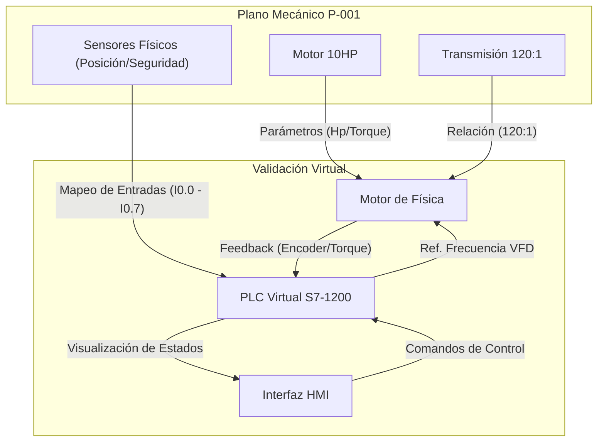

# Manual Técnico de Operación y Validación de Ingeniería
## Gemelo Digital ZASCA (Sistema Paternoster)

**Versión:** 2.0  
**Fecha:** Febrero 2026  
**Referencia:** Validación de Planos P-001 (Mecánica) y P-002 (Estructural)

---

## 1. Introducción y Alcance
Este documento establece los lineamientos técnicos para la operación del **Gemelo Digital ZASCA**, una herramienta de simulación de alta fidelidad diseñada no solo para entrenamiento, sino como el estándar primario para la **validación de ingeniería** antes de la construcción física.

El sistema simula en tiempo real la física, lógica de control (PLC) e interacción mecánica descrita en los planos constructivos, permitiendo verificar:
1.  **Integridad Mecánica (P-001):** Torques, potencias y relaciones de transmisión.
2.  **Seguridad Estructural (P-002):** Comportamiento de bandejas, colisiones y espacios libres.
3.  **Lógica Operativa:** Flujos de proceso y respuesta ante fallas.

---

## 2. Anatomía de la Interfaz: Correspondencia con Ingeniería
La interfaz gráfica del simulador ("Siemens HMI Virtual") actúa como una ventana técnica al diseño del equipo. A continuación se detalla la correlación entre los controles virtuales y las especificaciones de ingeniería.

### ZONA A: Telemetría de Tren de Potencia (Validación P-001)
*Ubicación: Panel Lateral Izquierdo (Azul)*

Esta zona monitorea el comportamiento del sistema de transmisión principal definido en el plano P-001.

*   **Motor Data:**
    *   **Torque (Nm):** Visualización en tiempo real de la carga en el eje. *Límite P-001: 1500 Nm.* Permite validar si el motor SEW de 10HP es suficiente para la carga actual.
    *   **RPM:** Velocidad angular del motor tras la reducción.
    *   **Power (HP):** Consumo de potencia instantáneo.

*   **Posición Espacial (X/Y/Z):**
    *   Coordenadas exactas de la bandeja en seguimiento. Utilizado para verificar la cinemática de la cadena (Paso 20A-1) y la precisión del encoder virtual.

*   **Respuesta Escalón (Gráfica):**
    *   Curva de aceleración/desaceleración que valida la configuración de las rampas del Variador de Frecuencia (VFD).

### ZONA B: Visualización Estructural (Validación P-002)
*Ubicación: Centro (Modelo 3D)*

Representación a escala 1:1 de los planos estructurales P-002.

*   **Modelo Físico:** Renderizado de columnas, guías y bandejas.
*   **Etiquetas Flotantes (Labels):**
    *   Muestran dinámicamente el ID de la bandeja y su contenido.
    *   Se utilizan para verificar visualmente los "Clearances" (espacios libres) entre bandejas en movimiento, evitando colisiones mecánicas por diseño.
*   **Panel VFD Flotante:** Indicador de estado del variador (Voltaje DC Bus/Corriente) ubicado sobre el gabinete de control virtual.

### ZONA C: Panel de Operación y Control (HMI)
*Ubicación: Panel Derecho (Verde/Negro)*

Control central que replica el HMI Físico **Siemens KTP700 Basic**. Su distribución es funcional y crítica para la operación.

---

## 3. Procedimientos de Operación Estándar (SOP)

### 3.1 Protocolo de Arranque Seguro (Startup 10s)
Este procedimiento es **OBLIGATORIO** para garantizar la integridad de la máquina virtual y física al inicio de turno.

1.  **Estado Inicial:** Verificar que el sistema esté encendido y el botón inferior indique **"GLOBAL E-STOP OK"** (Color Blanco).
2.  **Verificación Previa:** Confirmar en la lista superior "SYSTEM STATUS" que no existan alarmas activas y que el PLC indique "CONNECTED".
3.  **Arranque y Monitoreo (Ventana de 10 Segundos):**
    *   Realizar el primer movimiento de prueba (vacío).
    *   **Observar durante 10 segundos:**
        *   Panel VFD: Voltaje estable (440V/220V según config).
        *   Amperaje: Debe mantenerse por debajo de la corriente nominal.
        *   Telemetría: El torque no debe presentar picos abruptos al arranque.
4.  **Habilitación:** Si tras 10 segundos los parámetros son nominales, proceda a la operación normal.

### 3.2 Ciclo de Movimiento (Selección de Bandeja)
Operación estándar para posicionar mercancía frente al operador.

1.  **Selección:** En el HMI Virtual, use la lista desplegable **"1. SELECCIONAR BANDEJA"** para elegir el destino (ej. "BANDEJA 10").
2.  **Cálculo de Ruta:** El sistema determinará automáticamente la dirección más corta (Arriba/Abajo) según la lógica "Step Function".
3.  **Ejecución:** Presione el botón verde **[MOVER]**.
    *   *Feedback:* El texto de estado cambiará de "READY" a "MOVING".
4.  **Finalización:** Espere a que el indicador muestre **"POSICIÓN OK"** en texto verde brillante.

### 3.3 Gestión de Inventario (Picking)
Simulación de las tareas de carga/descarga en la zona **"3. PICKING"**.

1.  **Identificación:** Al llegar una bandeja, el HMI mostrará su contenido automáticamente (ej. "REF A: 1 UND").
2.  **Acciones:**
    *   **[SACAR (0)]:** Simula que el operador retira una unidad de la referencia seleccionada.
    *   **[RETIRAR]:** Vacía completamente la posición de la bandeja.
3.  **Registro:** El contador "Total Harnesses" en el panel superior se actualizará instantáneamente, permitiendo llevar control de producción.

### 3.4 Entrenamiento de Fallas y Emergencias
El panel rojo **"FAULT INJECTION"** es exclusivo para entrenamiento técnico y simulación de averías.

*   **Botón [TRIP E-STOP]:**
    *   *Acción:* Simula la rotura física del lazo de seguridad (cableado P-001) o la presión de una seta de emergencia.
    *   *Consecuencia:* Detención inmediata del Motor de Física (freno mecánico) y alarma en el HMI.
*   **Botón [SENSOR CLEAR]:**
    *   *Uso:* Se utiliza para "limpiar" virtualmente sensores ópticos que hayan quedado bloqueados por suciedad u objetos extraños en la simulación.

---

## 4. Diagrama de Conectividad y Flujo de Señales
Este diagrama ilustra cómo el Gemelo Digital valida la ingeniería física conectando los planos mecánicos con la lógica de control.

---

## 5. Guía de Solución de Fallas (Troubleshooting)

Esta tabla permite correlacionar síntomas virtuales con problemas físicos reales, facilitando el mantenimiento preventivo y correctivo.

| Síntoma / Alerta HMI | Tag PLC | Causa Física Probable (P-001/P-002) | Acción Correctiva Recomendada |
| :--- | :--- | :--- | :--- |
| **TRIP E-STOP** | `I0.0` = LOW | Circuito de seguridad abierto, seta presionada o rotura de cable. | Verificar continuidad eléctrica en el bloque de seguridad y estado de setas. |
| **VFD OVERCURRENT** | `I > Nominal` | Fricción excesiva en guías (P-002) o falta de lubricación en cadena. | Inspeccionar alineación de rieles y lubricar cadena 20A-1. Verificar freno motor. |
| **POSICIÓN ERRÁTICA** | `Err > 2mm` | Deslizamiento del encoder o estiramiento excesivo de cadena. | Tensar cadena según manual mecánico y recalibrar "Zero" del encoder. |
| **SAFETY DOOR OPEN** | `I0.4` = LOW | Puerta de acceso a mantenimiento abierta. | Asegurar cierre de puertas y reiniciar rele de seguridad. |
| **MOTOR STALLED** | `Speed = 0` | Bloqueo mecánico severo (objeto atascado). | **PARADA INMEDIATA.** Inspeccionar trayectoria de bandejas por obstrucciones. |

---

**Nota Final:** Este manual debe utilizarse en conjunto con los planos P-001 y P-002 para cualquier modificación física o de software en el sistema ZASCA.
