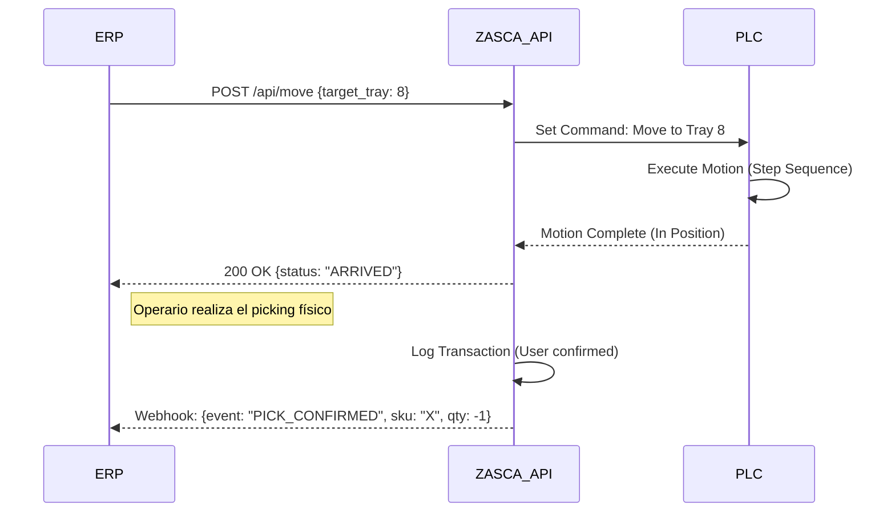

# Especificación de Requerimientos Funcionales (FRS)
**Proyecto:** Sistema ZASCA (Automated Vertical Carousel)
**Fecha:** 13 de Febrero de 2026
**Estado:** Actualizado (V2.0 - Alineado con P-001)

Este documento define formalmente **qué debe hacer** el sistema (Comportamiento) para cumplir con las necesidades operativas y de seguridad.

---

## 1. Requerimientos de Operación y Movimiento (Motion Control)

| ID | Requerimiento | Descripción / Criterio de Aceptación |
| :--- | :--- | :--- |
| **FR-01** | **Selección Automática de Bandeja** | El sistema debe mover el carrusel automáticamente a la posición de la bandeja solicitada por el usuario desde el HMI. |
| **FR-02** | **Ruta Óptima (Shortest Path)** | El PLC debe calcular y ejecutar la ruta más corta (CW o CCW) para llegar al destino, minimizando el tiempo de espera. |
| **FR-03** | **Posicionamiento Preciso** | La bandeja debe detenerse en la "Zona Dorada" (90cm - 110cm) con una tolerancia de **±2mm** (Validado en simulación con Step Function). |
| **FR-04** | **Perfil de Velocidad Escalonado** | El movimiento debe implementar una estrategia de aproximación por pasos (**Crucero -> Aproximación -> Crawl**) para garantizar paradas suaves sin oscilación. |
| **FR-05** | **Modo "Jog" (Manual)** | El personal de mantenimiento debe poder mover el carrusel paso a paso desde el panel mientras se mantenga presionado el botón (Dead-man switch). |
| **FR-06** | **Homing / Referenciado** | El sistema debe tener una rutina para encontrar su "Cero" absoluto en caso de pérdida de energía. |

## 2. Requerimientos de Seguridad (Safety)

| ID | Requerimiento | Descripción / Criterio de Aceptación |
| :--- | :--- | :--- |
| **FR-07** | **Cortina de Luz (Intrusión)** | Si la cortina de luz detecta un objeto (mano/brazo) durante el movimiento, el sistema debe realizar una **Parada de Emergencia (Categoría 0)** inmediata. |
| **FR-08** | **Enclavamiento de Puerta** | El sistema no debe poder iniciar movimiento automático si la puerta lateral de mantenimiento está abierta (`DoorClosed = FALSE`). |
| **FR-09** | **Parada de Emergencia (E-Stop)** | Al pulsar el hongo de emergencia, se debe cortar físicamente la alimentación del motor (Contactor Off) y aplicar el freno mecánico. |
| **FR-10** | **Freno por Ausencia de Energía** | En caso de corte eléctrico, el freno mecánico debe cerrarse automáticamente para evitar la caída de la carga por gravedad (**Torque de Freno > 20 Nm**). |

## 3. Requerimientos de Interfaz (HMI & UX)

| ID | Requerimiento | Descripción / Criterio de Aceptación |
| :--- | :--- | :--- |
| **FR-11** | **Autenticación de Usuario** | El operador debe ingresar un ID/PIN para acceder al sistema. Cada transacción quedará asociada a este usuario. |
| **FR-12** | **Telemetría en Tiempo Real** | El HMI debe mostrar una gráfica de **Velocidad vs Comando** y visualizar los pasos de la rampa de aceleración/desaceleración. |
| **FR-13** | **Indicador de Llegada** | El sistema debe indicar visualmente (Cambio de color a **ROJO**) cuando la bandeja ha alcanzado la posición final y es seguro operar. |
| **FR-14** | **Indicadores de Estado** | El estado del sistema (Ready, Running, Fault, Maintenance) debe ser visible claramente en el HMI y en la Torre de Luz. |

## 4. Requerimientos de Datos e Integración (Data & ERP)

| ID | Requerimiento | Descripción / Criterio de Aceptación |
| :--- | :--- | :--- |
| **FR-15** | **Inventario en Tiempo Real** | El sistema debe mantener una base de datos local actualizada de qué ítems están en cada bandeja. |
| **FR-16** | **Registro de Transacciones (Log)** | Cada operación (Entrada/Salida) debe generar un registro con: *Timestamp, Usuario, Ítem, Cantidad, Tipo Movimiento*. |
| **FR-17** | **Reporte de Stock Bajo** | El sistema debe generar una alerta visual cuando la cantidad de un ítem caiga por debajo del mínimo configurado. |
| **FR-18** | **API de Conexión ERP** | El sistema debe exponer una interfaz (REST API, SQL, o Archivos Planos) para que el ERP externo pueda leer el stock y enviar órdenes de picking. |

## 5. Requerimientos No Funcionales (Performance & Quality)

| ID | Requerimiento | Especificación P-001 |
| :--- | :--- | :--- |
| **NFR-01** | **Capacidad de Carga** | El sistema debe soportar una carga útil de **240 kg** (20 bandejas x 12 kg) + Estructura (740 kg). Motor de **5 HP**. |
| **NFR-02** | **Disponibilidad** | Diseñado para operación continua (S1) con factor de servicio de reductor **1.45**. |
| **NFR-03** | **Tiempo de Respuesta** | Tiempo máximo de ciclo (5 bandejas) < **15 segundos**. |
| **NFR-04** | **Recuperación** | Reinicio tras parada de emergencia < **5 segundos**. |

---

## 6. Especificación de Interfaz de Datos (API REST)

Detalle técnico de la integración "Máquina a Máquina" (M2M) para el requerimiento **FR-18**.

**Protocolo:** HTTP/JSON sobre Ethernet (TCP/IP).
**Puerto:** 8080 (Configurable).

### A. Endpoints Principales

#### 1. Verificar Estado (`GET /api/status`)
El ERP consulta si la máquina está lista para trabajar.

*   **Respuesta (200 OK):**
    ```json
    {
      "status": "IDLE", // IDLE, BUSY, ERROR, MAINTENANCE
      "current_tray": 5,
      "door_closed": true,
      "safety_ok": true
    }
    ```

#### 2. Mover Carrusel (`POST /api/move`)
El ERP ordena traer una bandeja específica (ej. para surtir una orden de producción).

*   **Payload (Solicitud):**
    ```json
    {
      "target_tray": 12,
      "priority": "HIGH"
    }
    ```
*   **Respuesta (202 Accepted):** `{"job_id": 1024, "estimated_time": "15s"}`

### B. Diagrama de Secuencia (Picking Integrado)



---

## 7. Requerimientos Estructurales y Mecánicos (Soporte Físico)

Esta sección define los componentes físicos que garantizan el cumplimiento de la funcionalidad (Alineado con especificación 5 HP).

| ID Funcional | Requerimiento de Movimiento | Componente Estructural/Mecánico | Especificación (Validada 5 HP) |
| :--- | :--- | :--- | :--- |
| **FR-01** | Selección Automática | **Sistema de Tracción Vertical** | Motor 5 HP (3.7 kW) con Reductor Ortogonal 40:1. |
| **FR-03** | Precisión 2mm | **Transmisión Rígida** | Cadena ANSI 100 Tensada + Guías UHMW para eliminar juego. |
| **FR-04** | Perfil Escalonado | **Frenado Dinámico** | Resistencia de Frenado del VFD + Freno Mecánico 220VAC. |
| **NFR-01** | Carga 240kg | **Chasis Portante** | Perfil Estructural 100x100x4mm (Acero ASTM A500 Gr. C). |
| **NFR-01** | Resistencia de Ejes | **Eje Principal Motriz** | Acero 4140 Bonificado, Diámetro 2.5" (63.5mm). |
| **NFR-02** | Disponibilidad | **Rodamientos de Apoyo** | Chumaceras de Pie (Pillow Block) UCP 212 de alta carga estática. |
