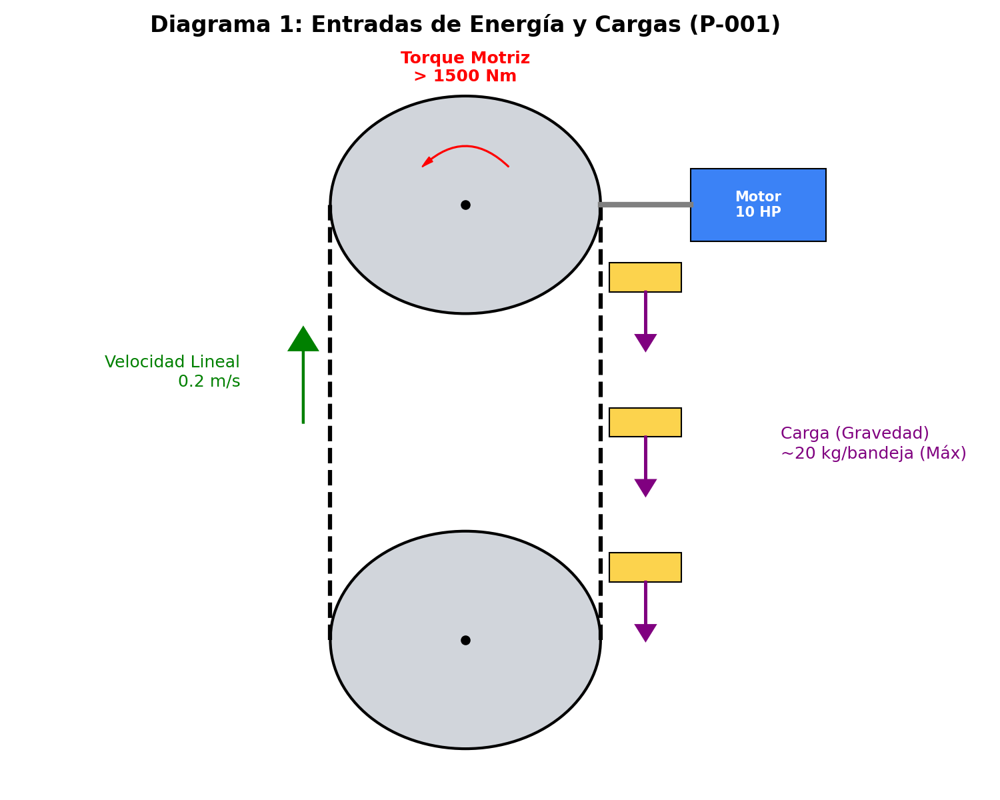
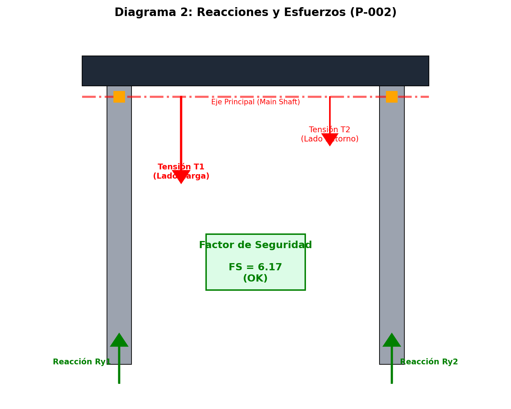
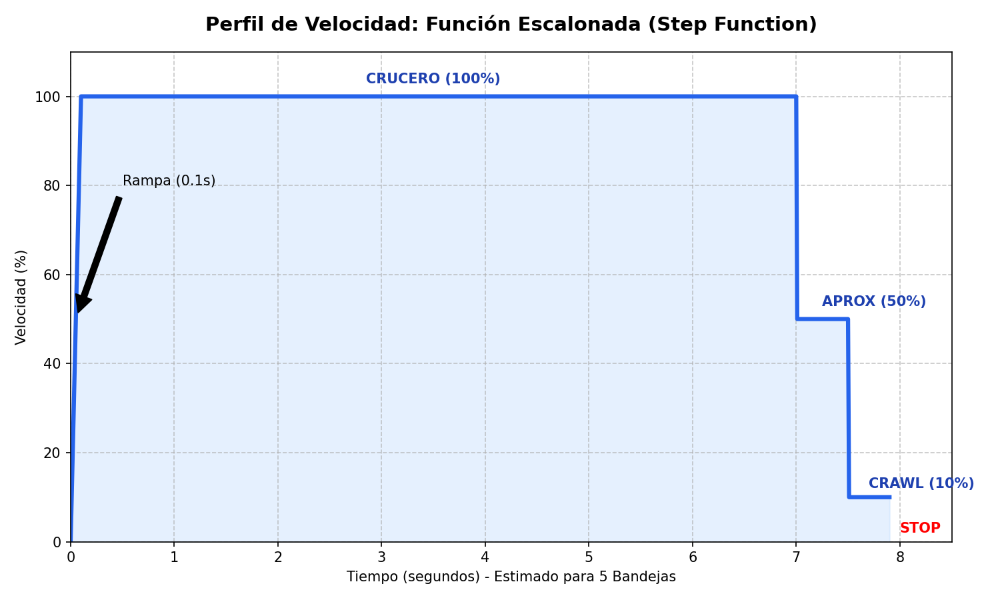

# Modelo Cinemático y Físico del Carrusel Vertical ZASCA

Este documento explica las matemáticas utilizadas en el software de simulación (`PhysicsEngine.ts`). Se han alineado los parámetros con la validación mecánica del **Plano P-001**.

---

## 1. Glosario de Variables Físicas

Variables utilizadas en los cálculos de dinámica y cinemática (Basadas en P-001).

| Símbolo | Variable | Unidad | Valor Asumido | Descripción Física |
| :--- | :--- | :--- | :--- | :--- |
| **R** | Radio del Piñón | metros (m) | `0.127 m` | Radio de paso del piñón de 15 dientes (Paso 1.25"). |
| **H** | Distancia entre Ejes | metros (m) | `2.779 m` | Altura vertical de la sección recta (Dimensión P-001). |
| **L** | Longitud de Cadena | metros (m) | `6.257 m` | $2\cdot H + 2\cdot \pi \cdot R$. Longitud "lineal" del recorrido de una bandeja (aprox). |
| **M** | Masa Total | Kilogramos (kg) | `740 kg` | Masa combinada de cadenas, palets y estructura móvil (sin carga variable). |
| **I** | Inercia Rotacional | $kg \cdot m^2$ | `118.4 + Carga` | Resistencia del sistema a cambiar de velocidad angular. ($I = M \cdot R^2$) |
| **Theta (θ)** | Posición Angular | Grados (°) | `0 - 360` | Ángulo del eje motriz. 0° = Eje Horizontal Derecho. |
| **Omega (ω)** | Velocidad Angular | radianes/seg | Variable | Velocidad de rotación del eje motriz. |
| **Alpha (α)** | Aceleración Angular | rad/s² | Variable | Cambio de velocidad en el tiempo. |
| **Tau (τ)** | Torque (Par) | Newton-metro (Nm) | Variable | Fuerza de giro aplicada por el motor o cargas. |

### Diagrama de Cuerpo Libre (Entradas)

*Figura 1: Representación de las fuerzas de entrada, torque y velocidad lineal.*

---

## 2. Ecuaciones de Movimiento (Dinámica)

El sistema se mueve según la Segunda Ley de Newton para rotación: **Torque = Inercia x Aceleración**.

### A. Cálculo del Torque Neto
El torque total que realmente mueve el sistema es la suma del torque del motor menos las resistencias.

```math
Torque_Neto = Torque_Motor - Torque_Fricción - Torque_Gravedad
```

1.  **Torque_Motor:** Fuerza generada por el variador (VFD) según la **Función Escalonada**.
    *   El motor es de **5 HP (3.7 kW)** con una relación total de **120:1**.
    *   Torque Disponible en Eje > **1500 Nm**.
2.  **Torque_Fricción:** Resistencia al movimiento. Se asume `250 Nm` constantes opuestos al giro.
3.  **Torque_Gravedad:** Torque generado por el desbalance de peso (bandejas llenas vs vacías).

### B. Integración (Paso a Paso)
En cada ciclo de simulación (aprox. 60 veces por segundo):

1.  Calculamos cuánto acelera el sistema:
    ```math
    Aceleración (alpha) = Torque_Neto / Inercia
    ```

2.  Calculamos la nueva velocidad:
    ```math
    Velocidad_Nueva = Velocidad_Actual + (Aceleración * Tiempo_Delta)
    ```

3.  Calculamos la nueva posición:
    ```math
    Posición_Nueva = Posición_Actual + (Velocidad * Tiempo_Delta)
    ```

---

## 3. Cinemática: Mapeo de Cadena (Lineal a 3D)

Las bandejas se mueven linealmente sobre la cadena. Para dibujarlas en 3D, convertimos su posición lineal **$L$** a coordenadas **$(x, y)$**.

El recorrido se divide en 4 Zonas (Altura H = 2.779m):

### Zona 1: Subida Vertical (Izquierda)
*   **Posición X:** `-R` (Fijo a la izquierda)
*   **Posición Y:** `L` (Sube linealmente hasta H)

### Zona 2: Curva Superior (Media Luna)
*   Calculamos el ángulo de giro `phi`.
*   **Posición X:** `R * cos(phi)`
*   **Posición Y:** `H + (R * sin(phi))`

### Zona 3: Bajada Vertical (Derecha)
*   **Posición X:** `R` (Fijo a la derecha)
*   **Posición Y:** `H - Distancia_Recorrida_Desde_Arriba`

### Zona 4: Curva Inferior (Retorno)
*   **Posición X:** `R * cos(ángulo)`
*   **Posición Y:** `R * sin(ángulo)` (Se vuelve negativo, bajo el eje)

---

## 4. Estrategia de Control (Función Escalonada)

Se abandona el PID clásico por una lógica de pasos determinista para garantizar precisión sin oscilación ("hunting").

### Lógica del PLC Virtual (`Processor.ts`)
1.  **Distancia > 2.0 Bandejas:** Velocidad **Crucero (100%)**.
2.  **Distancia < 2.0 Bandejas:** Velocidad **Aproximación (50%)**.
3.  **Distancia < 0.5 Bandejas:** Velocidad **Crawl/Reptado (10%)**.
    *   Crucial para acercarse al sensor final con alto torque y baja inercia.
4.  **Distancia < 0.02 Bandejas:** Zona Muerta -> **STOP (0%)** + Freno Mecánico.

---

## 5. Ejemplo Numérico (P-001 Check)

**Verificación de Torque para caso de Desbalance Extremo.**

### Condiciones
*   **Desbalance:** 10 bandejas llenas subiendo (120 kg) vs 10 vacías bajando.
*   **Radio (R):** 0.127 m.
*   **Gravedad (g):** 9.81 m/s².

### Cálculo
1.  **Torque de Carga (Gravedad):**
    *   $T_g = Masa \cdot g \cdot R$
    *   $T_g = 120 \cdot 9.81 \cdot 0.127 = \mathbf{149.5 \text{ Nm}}$
2.  **Fricción (Conservadora):** 250 Nm.
3.  **Torque Total Requerido:** $149.5 + 250 = \mathbf{399.5 \text{ Nm}}$.

### Capacidad del Motor Seleccionado (10 HP)
*   **Potencia:** 7.5 kW.
*   **RPM Salida:** 14.5 RPM (1.5 rad/s).
*   **Torque Nominal Salida:**
    *   $P = T \cdot \omega \rightarrow T = P / \omega$
    *   $T = 7500 / 1.5 = \mathbf{5000 \text{ Nm}}$.

### Conclusión (Factor de Seguridad)
*   **FS = Torque_Disponible / Torque_Requerido**
*   **FS = 5000 / 399.5 = 12.51**

**RESULTADO: APROBADO.** El motor de 10 HP excede masivamente los requerimientos, ideal para ciclos de trabajo intensivo y arranques frecuentes.

---

## 6. Diagrama de Reacciones Estructurales (P-002)


*Figura 2: Reacciones en los soportes y tensión en la cadena bajo carga.*

Este diagrama resume los resultados del análisis estructural:
*   **Tensiones (T1, T2):** Carga transmitida al eje principal.
*   **Reacciones (Ry):** Fuerzas que deben soportar las chumaceras y la estructura vertical.
*   **Factor de Seguridad:** **12.51**, confirmando la robustez extrema del diseño.

---

## 7. Perfil de Movimiento


*Figura 3: Perfil de velocidad escalonado generado desde Python.*

1.  **Crucero (100%):** Movimiento rápido entre pisos lejanos.
2.  **Aproximación (50%):** Reducción controlada al acercarse.
3.  **Crawl (10%):** Acercamiento final de alta precisión (ajustado manualmente a 10%).
4.  **Stop (0%):** Clavado de freno en posición exacta.
