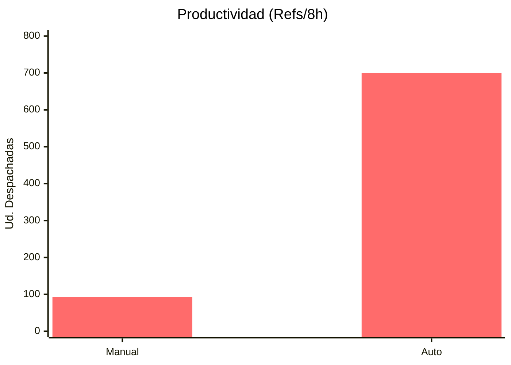
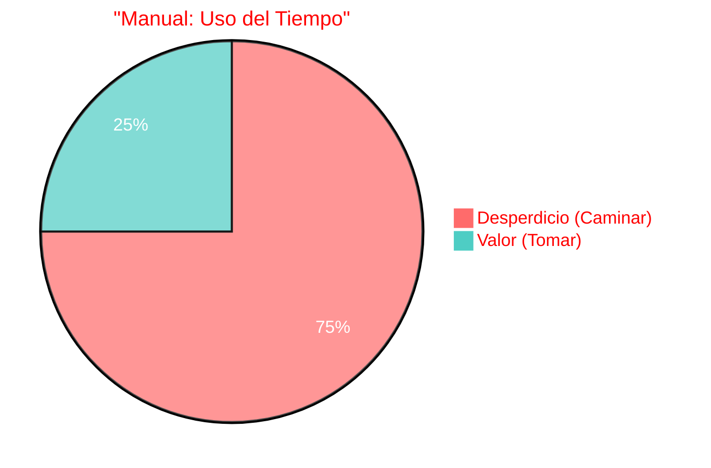
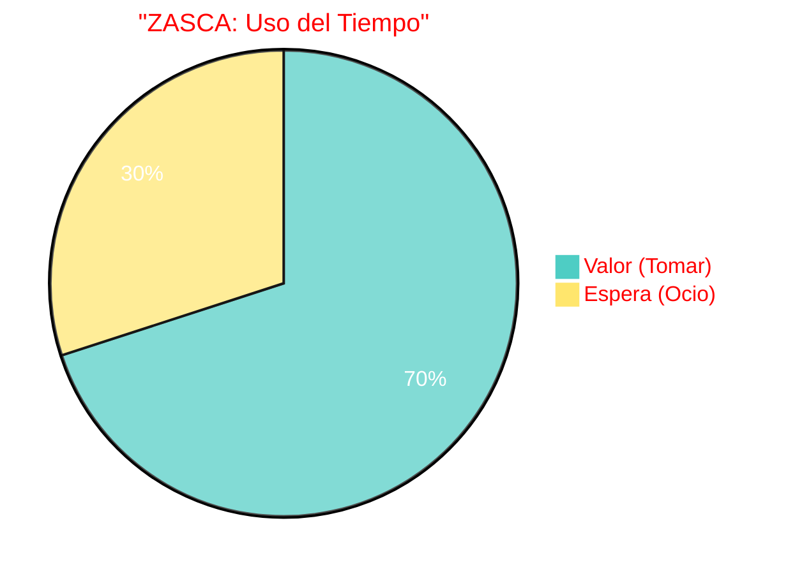
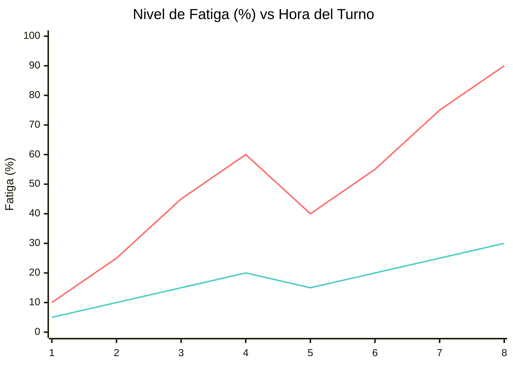
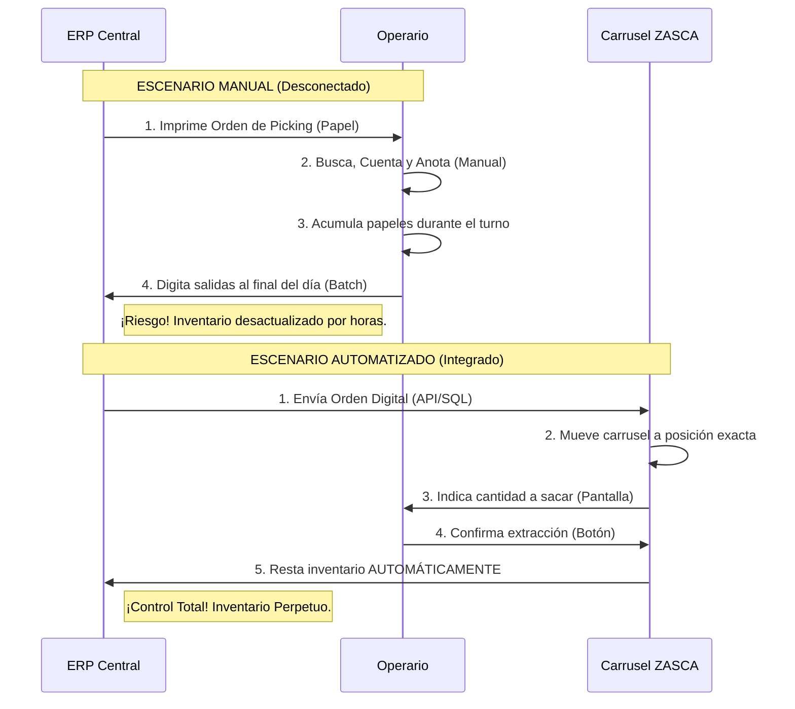

# Ficha de Análisis de Impactos Operativos y Humanos
**Proyecto:** Sistema ZASCA (Automated Vertical Carousel)
**Fecha:** 06 de Febrero de 2026

Este documento compara cuantitativa y cualitativamente el proceso de "Picking" (selección de pedidos) en su versión **Manual Tradicional** vs. la versión **Automatizada (ZASCA)**.

---

## 1. Definición del Escenario de Prueba

Para realizar una comparación justa, se define el siguiente escenario estándar de operación:

*   **Tarea:** Recolección de Kits de Producción (Picking).
*   **Volumen:** 10 Referencias (SKUs) distintas por orden de trabajo.
*   **Duración del Turno:** 8 Horas (480 minutos).
*   **Perfil de Carga:** Elementos de 2kg a 5kg (Arneses y Componentes Electrónicos).

### Los Contendientes

1.  **Proceso Manual (Estantería Convencional):**
    *   Operario camina por pasillos buscando la ubicación.
    *   Usa escalera tipo tijera para alcanzar niveles superiores (2m+).
    *   Carga el peso mientras baja la escalera.
    *   Regresa al punto de acopio.

2.  **Proceso Automatizado (ZASCA):**
    *   Operario permanece en la estación de trabajo (Punto fijo).
    *   Digita la referencia en el HMI.
    *   El sistema trae la bandeja a la "Zona Dorada" (Altura ergonómica: 90cm - 1.10m).
    *   Desliza el producto a la mesa de trabajo (sin levantar).

---

## 2. Análisis Cuantitativo (Tiempos y Movimientos)

Estimación de tiempos promedio por ciclo (1 Referencia).

| Fase del Proceso | Manual (Minutos) | Automatizado ZASCA (Minutos) | Diferencia |
| :--- | :--- | :--- | :--- |
| **Búsqueda (Caminar)** | 1.5 min | 0.0 min | **-100%** |
| **Localización Visual** | 0.5 min | 0.1 min (Luz Indicadora) | **-80%** |
| **Acceso (Escalera/Giro)**| 1.0 min | 0.3 min (Tiempo de Giro) | **-70%** |
| **Extracción y Regreso** | 1.5 min | 0.2 min | **-86%** |
| **TOTAL POR REFERENCIA** | **4.5 minutos** | **0.6 minutos (36 seg)** | **-87%** |

### Proyección a Turno de 8 Horas

*   **Tiempo Disponible Real:** 7 horas (descontando pausas activas y almuerzo) = 420 minutos.

**A. Capacidad Máxima Teórica (Referencias por Turno):**
*   **Manual:** 420 min / 4.5 min = **93 Referencias**.
*   **ZASCA:** 420 min / 0.6 min = **700 Referencias**.
*   **Factor de Mejora:** **7.5x**.

**B. Distancia Recorrida (Fatiga):**
*   **Manual:** Promedio 20 metros por referencia x 93 ref = **1.86 Kilómetros** caminando.
*   **ZASCA:** 0 metros.

---

## 3. Gráficas Estadísticas

### Rendimiento Comparativo (Picking por Turno)

### Distribución del Tiempo Operativo

---

## 4. Análisis de Impacto Humano (Ergonomía y Seguridad)

Este es el factor crítico para la justificación de la inversión más allá de la productividad.

### A. Zona de Trabajo (Ergonomía)
*   **Manual:** Obliga al operario a realizar flexiones (nivel suelo) y extensiones (nivel >1.70m).
    *   *Riesgo:* Lesiones lumbares y fatiga muscular acumulada.
*   **ZASCA:** Entrega siempre en la **"Zona Dorada"** (Cintura-Pecho).
    *   *Beneficio:* Elimina la necesidad de agacharse o estirarse.

### B. Riesgo de Accidente
*   **Manual:** Uso de escaleras con carga en manos (Riesgo Alto de Caída). Tráfico cruzado con montacargas en pasillos.
*   **ZASCA:** Operario confinado en zona segura. Barreras de luz (Cortinas de Seguridad) detienen el equipo si hay intrusión. Cero trabajo en alturas.

### C. Carga Cognitiva
*   **Manual:** Estrés por memorizar ubicaciones ("¿Dónde estaba el cable X?"). Frustración por inventario fantasma (ir al sitio y que no esté).
*   **ZASCA:** Sistema "Go-to-Light". La máquina presenta el ítem. El estrés de búsqueda se elimina totalmente.

### D. Curva de Fatiga (Turno de 8 Horas)

*   **Línea Superior (Manual):** La fatiga crece exponencialmente por el esfuerzo físico. Al final del turno, la probabilidad de error aumenta drásticamente.
*   **Línea Inferior (ZASCA):** La fatiga se mantiene controlada y lineal, ya que el esfuerzo es mínimo. La calidad del trabajo es constante a las 8:00 AM y a las 4:00 PM.

---

## 5. Control de Bodega e Integración ERP (Comparativa)

Análisis del flujo de información y control de inventario entre el método manual y la integración automatizada.

### Tabla Comparativa de Control

| Característica | Bodega Manual (Salida por Lote) | ZASCA + ERP (Integrado) | Impacto |
| :--- | :--- | :--- | :--- |
| **Registro de Salida** | Diferido (Papel -> Digitación posterior). | **Tiempo Real** (Automático al pulsar botón). | Elimina desfases de inventario. |
| **Precisión (Accuracy)** | ~95% (Errores humanos de conteo/lectura). | **99.9%** (Picking dirigido y validado por luz). | Elimina "Inventario Fantasma". |
| **Seguridad / Trazabilidad** | Baja. Cualquiera puede tomar un ítem sin registro. | **Total**. Requiere Login (ID) para mover el carrusel. | Auditoría exacta de "Quién, Qué, Cuándo". |
| **Actualización de Stock** | Por Lotes (Al final del turno/día). | **Transaccional** (Ítem por ítem al instante). | ERP refleja la realidad al segundo. |
| **Reabastecimiento** | Reactivo (Cuando se nota que falta). | **Predictivo** (Alertas automáticas de stock bajo). | Evita paradas de producción por falta de material. |

### Flujo de Datos: Diferencia Crítica

### Conclusión de Control
La integración **ZASCA-ERP** transforma la bodega de una "Caja Negra" (donde solo se sabe qué entra y qué sale al final del día) a una **"Caja de Cristal"**, donde cada movimiento queda registrado, auditado y reflejado en los estados financieros de la empresa en tiempo real.
